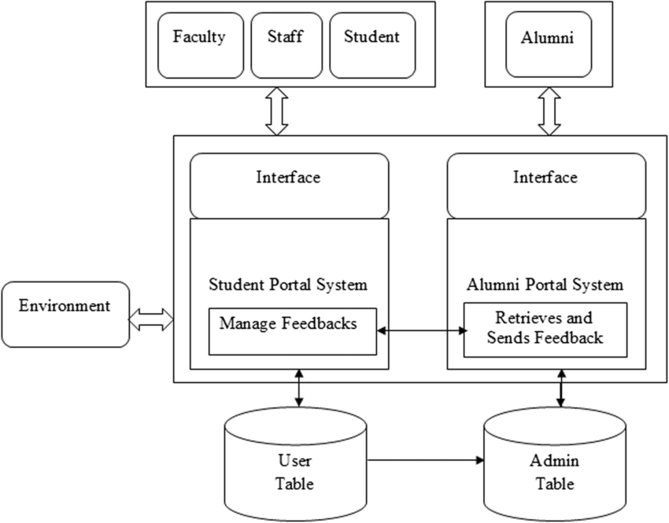
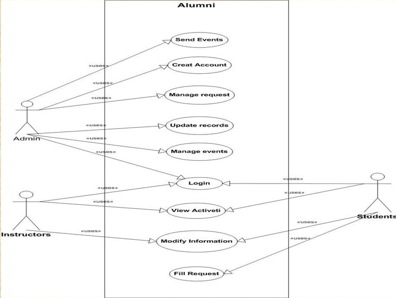

# Smart India Hackathon Workshop
# Date:3.12.2024
## Register Number:24900977
## Name:ARJUN K
## Problem Title
Implementation of the Alumni Association platform for the University/Institute.
## Problem Description
Background: Alumni associations play a pivotal role in fostering lifelong connections between graduates and their alma mater, facilitating networking, mentorship, and philanthropic support. However, many alumni associations face challenges in maintaining engagement, facilitating donations, and providing valuable services such as job networking and tracking alumni success stories. A comprehensive Alumni Association platform for a University/Institute, encompassing both web and mobile applications, aims to address these challenges effectively. Detailed Description: The proposed Alumni Association platform for the Government Engineering College will feature robust functionalities accessible through both web and mobile applications: Alumni Registration: User-friendly registration processes on both web and mobile platforms, allowing alumni to join the association, update their profiles, and stay connected with peers and the institution. Donation Portal: Secure mechanisms on both platforms for alumni to contribute donations easily and support various initiatives and projects undertaken by the college, fostering a culture of philanthropy. Networking Hub: Dedicated sections on both platforms to connect alumni based on shared interests, professions, and geographic locations, facilitating professional networking, mentorship, and collaboration opportunities. Job Portal: Integrated job search and posting features accessible via web and mobile apps, enabling alumni to explore career opportunities, post job openings, and connect with potential employers within the alumni network. Alumni Directory: Search functionalities available on both platforms to find alumni based on different criteria such as graduation year, field of study, industry, location, etc., promoting networking and community building. Success Story Tracking: Features on both web and mobile apps to showcase and track alumni achievements, success stories, and notable contributions to society, inspiring current students and fostering pride among alumni. Events and Reunions: Announcements, registrations, and management tools available on both platforms for organizing alumni events, reunions, workshops, and professional development sessions to maintain engagement and connection. Feedback and Surveys: Channels on both web and mobile apps for alumni to provide feedback on their experiences, suggest improvements, and participate in surveys to help shape future initiatives of the association. The platform will prioritize user experience, security, and scalability across both web and mobile applications to cater to the diverse needs of the Government Engineering College's alumni community. Expected Solution: Implementation of the Alumni Association platform for the Government Engineering College, comprising both web and mobile applications, is expected to achieve several positive outcomes: Enhanced Alumni Engagement: Seamless access to networking, career opportunities, and alumni events through web and mobile apps will strengthen connections among alumni, fostering a vibrant and active community. Increased Philanthropic Support: Convenient donation processes accessible via both platforms will encourage alumni to contribute towards the college's growth and development initiatives. Career Advancement: Access to job postings, mentorship opportunities, and professional networking on mobile devices will support alumni in their career growth and advancement. Knowledge Sharing: Exchange of knowledge, experiences, and best practices facilitated through both web and mobile apps will enrich professional development and lifelong learning initiatives. Pride and Recognition: Highlighting alumni achievements and success stories on both platforms will instill pride in the alma mater and inspire current students to excel in their academic and professional pursuits. Community Building: Interactive features available on both web and mobile apps will nurture a sense of belonging and camaraderie among alumni, strengthening their bond with the institution. In summary, the Alumni Association platform for the University/Institute, integrated with both web and mobile applications, aims to create a dynamic and supportive ecosystem where alumni can connect, contribute, and thrive, thereby enriching the overall educational experience and legacy of the institution.
## Problem Creater's Organization
Government of Gujarat

## Idea
1.VIRTUAL ALUMNI MENTORSHIP PROGRAM:
 IDEA:Create a structured mentorship program where alumni can sign up as mentors or mentees. Alumni can guide students or young alumni with career advice, industry insights, or life coaching.
FEATURE: Personalized matching based on skills, goals, and interests. Offer virtual office hours, career sessions, or one-on-one meetings.

2."ALUMNI OF THE MONTH" SPOTLIGHT:
IDEA: Each month, feature an inspiring alumnus who has made significant contributions to their field, community, or the university.
FEATURE: A dedicated webpage with their biography, achievements, and an interview or video message. This can encourage others to share their stories and create role models for current students.

3.ALUMNI LEARNING HUB:
IDEA: Create a knowledge-sharing hub where alumni can access exclusive webinars, courses, or learning materials to continue their personal and professional development.
FEATURE: Offer online workshops hosted by alumni, industry experts, or university faculty. You could also host exclusive webinars on emerging technologies or leadership skills for alumni looking to upskill.

4.ALUMNI-STUDENT COLLABORATION PROJECTS:
IDEA: Encourage alumni to collaborate with current students on university projects, thesis papers, or research.
FEATURE: Provide a platform to connect alumni with student groups, professors, or research initiatives. It could lead to joint publications, workshops, or internships.

5.SKILL-SHARING & VOLUNTEERING PLATFORM:
IDEA: Develop a section where alumni can offer skills (e.g., resume reviews, professional coaching, graphic design) or volunteer time to current students or the community.
FEATURE: Enable students to request help and alumni to list their skills in areas such as career advice, industry-specific knowledge, and more. Add a rating or feedback system to build trust.

## Proposed Solution / Architecture Diagram

FOR EXAMPLE:

## Use Cases

## Technology Stack
React.js

Node.js

PostgreSQL

Google maps

Firebox Authenticator

Git,Postman or Insomnia

## Dependencies
Mapping service - 10days
Data collection - 10days
Budget - Rs.50,000
